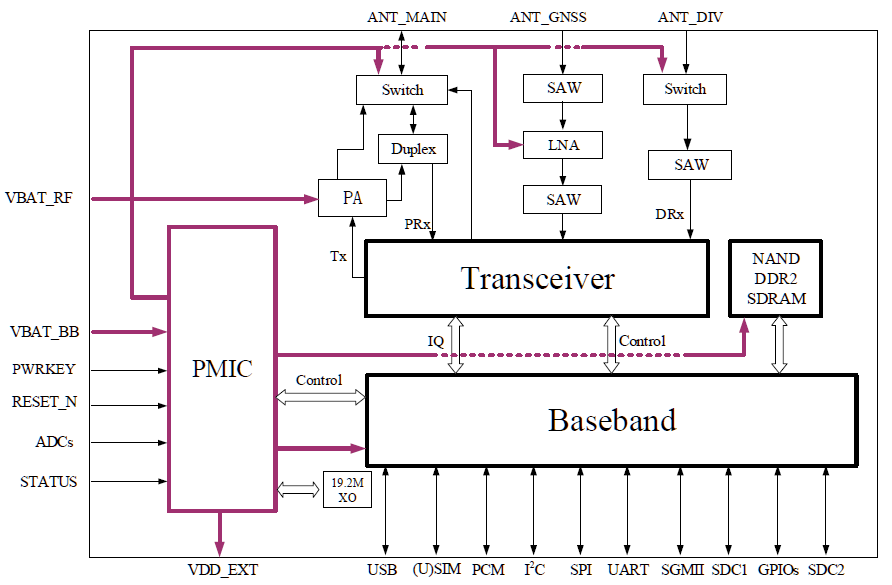
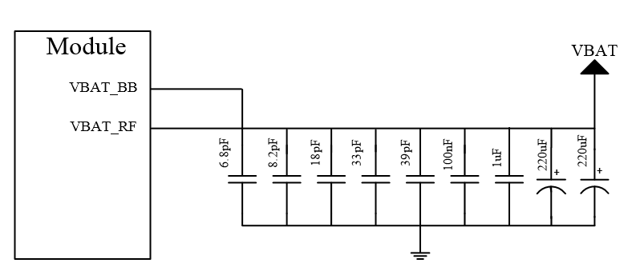
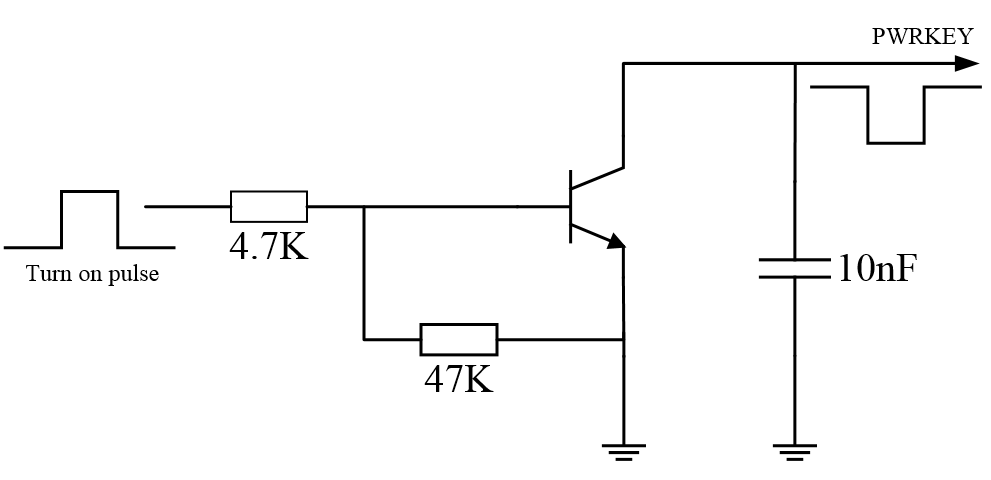

# FIBOCOM NL668-LA Series Hardware Guide
Version: V1.0.8 Date: 2021-08-30

#### **Applicability Type**
|No.|Product Model|Description|
|-|-|-|
|1|NL668-LA-00|MCP is 4Gbit Flash + 2Gbit RAM, support MAIN_ANT, DIV_ANT, GNSS_ANT|
|2|NL668-LA-01|MCP is 4Gbit Flash + 2Gbit RAM, support MAIN_ANT, DIV_ANT|
|3|NL668-LA-05|MCP is 2Gbit Flash + 1Gbit RAM, support MAIN_ANT, DIV_ANT, GNSS_ANT|
|4|NL668-LA-10|MCP is 1Gbit Flash + 1Gbit RAM, support MAIN_ANT, DIV_ANT, GNSS_ANT|
|5|NL668-LA-30|MCP is 4Gbit Flash + 2Gbit RAM, support MAIN_ANT, DIV_ANT, GNSS_ANT|
|6|NL668-LA-40|MCP is 4Gbit Flash + 4Gbit RAM, support MAIN_ANT, DIV_ANT, GNSS_ANT|

#### **Copyright**
Copyright ©2021 Fibocom Wireless Inc. All rights reserved.

Without the prior written permission of the copyright holder, any company or individual is prohibited to excerpt, copy any part of or the entire document, or transmit the document in any form.

#### **Notice**
The document is subject to update from time to time owing to the product version upgrade or other reasons. Unless otherwise specified, the document only serves as the user guide. All the statements, information and suggestions contained in the document do not constitute any explicit or implicit guarantee.

#### **Trademark**
The trademark is registered and owned by Fibocom Wireless Inc.

#### **Change History**

|Version |Author| Reviewer| Approver| Update Date| Description|
|-|-|-|-|-|-|
|V1.0.8|Zheng Shuai|Yu Yong|Jin Haibo|2021-08-30|
Add software description

 Update PIN description

Add model NL668-LA-30/40
|
|V1.0.7|Guo Zhenqi|Tan Lefan|Jin Haibo|2021-05-10|Modify pin 138 refer to design description|
|V1.0.6|Tan Lefan|Hu Wenkai|Luke Liu|2021-03-10|Add model NL668-LA-05 and NL668-LA-10|
|V1.0.5|Lee Du|Hu Wenkai|Luke Liu|2020-08-10|Update product appearance|
|V1.0.4|Hu Wenkai|Lee Du|Luke Liu|2020-03-13|Update power consumption|
|V1.0.3|Lee Du|Hu Wenkai|Luke Liu|2020-01-10|Add model NL668-LA-01|
|V1.0.2|Tan Lefan|Hu Wenkai|Luke Liu|2019-10-09|
Modify module size.
 
Increase the requirements of boot_config1, 2, 3 pins forbidden to pull up externally. 
|
|V1.0.1|Liu Qiang|Li Xiyi|Chen Guojiang|2019-07-09|Update RF parameters|
|V1.0.0|Gao Ying|Tu Min|Chen Guojiang|2019-06-06|Initial version|

## **Contents**

- [FIBOCOM NL668-LA Series Hardware Guide](#fibocom-nl668-la-series-hardware-guide)
      - [**Applicability Type**](#applicability-type)
      - [**Copyright**](#copyright)
      - [**Notice**](#notice)
      - [**Trademark**](#trademark)
      - [**Change History**](#change-history)
  - [**Contents**](#contents)
  - [1 Introduction](#1-introduction)
    - [1.1 Document Introduction](#11-document-introduction)
    - [1.2 Safety Precautions](#12-safety-precautions)
  - [2 Product Overview](#2-product-overview)
    - [2.1 Product Introduction](#21-product-introduction)
    - [2.2 Product Specification](#22-product-specification)
    - [2.3 Functional Diagram](#23-functional-diagram)
    - [2.4 Evaluation Board](#24-evaluation-board)
  - [3 Pin Description](#3-pin-description)
    - [3.1 Pin Assignment](#31-pin-assignment)
    - [3.2 Pin Function](#32-pin-function)
  - [4 Electrical Characteristics](#4-electrical-characteristics)
    - [4.1 Power](#41-power)
    - [4.2 Power Supply](#42-power-supply)
    - [4.3 1.8V Output](#43-18v-output)
    - [4.4 Power Consumption](#44-power-consumption)
  - [5 Functional Interface](#5-functional-interface)
    - [5.1 Control Interface](#51-control-interface)
      - [5.1.1 Power On/Off](#511-power-onoff)
      - [5.1.2 RESET](#512-reset)
    - [5.2 Network Status Indicate Interface](#52-network-status-indicate-interface)
      - [5.2.1 Interface Status Description](#521-interface-status-description)
    - [5.3 (U)SIM Card Interface](#53-usim-card-interface)
      - [5.3.1 (U)SIM Pin Definition](#531-usim-pin-definition)
      - [5.3.2 (U)SIM Interface Circuit](#532-usim-interface-circuit)
      - [5.3.3 (U)SIM Hot Plug](#533-usim-hot-plug)
      - [5.3.4 (U)SIM Design Requirements](#534-usim-design-requirements)
    - [5.4 USB Interface](#54-usb-interface)
      - [5.4.1 USB Pin Definition](#541-usb-pin-definition)
    - [5.5 UART Interface](#55-uart-interface)
      - [5.5.1 UART Interface Definition](#551-uart-interface-definition)
      - [5.5.2 UART Port Application](#552-uart-port-application)
    - [5.6 ADC Interface](#56-adc-interface)
    - [5.7 PCM Interface](#57-pcm-interface)
      - [5.7.1 Supported Model](#571-supported-model)
      - [5.7.2 PCM Interface Definition](#572-pcm-interface-definition)
      - [5.7.3 PCM Interface Description](#573-pcm-interface-description)
      - [5.7.4 PCM Signal Description](#574-pcm-signal-description)
  - [6 Low Power Consumption](#6-low-power-consumption)
    - [6.1 Airplane Mode](#61-airplane-mode)
    - [6.2 Sleep Mode](#62-sleep-mode)
      - [6.2.1 USB Application (Nonsupport USB Suspend, Support VBUS)](#621-usb-application-nonsupport-usb-suspend-support-vbus)
      - [6.2.2 USB Application (Nonsupport USB Suspend, Nonsupport VBUS)](#622-usb-application-nonsupport-usb-suspend-nonsupport-vbus)
      - [6.2.3 USB Application (Support USB Suspend)](#623-usb-application-support-usb-suspend)
      - [6.2.4 UART Application (WAKEUP_IN Pin Level Control)](#624-uart-application-wakeup_in-pin-level-control)
      - [6.2.5 UART Application (DTR Pin Level Control)](#625-uart-application-dtr-pin-level-control)
      - [6.2.6 ATS24 Command](#626-ats24-command)
  - [7 RF Interface](#7-rf-interface)
    - [7.1 Operating Bands](#71-operating-bands)
    - [7.2 Output Power](#72-output-power)
    - [7.3 Receive Sensitivity](#73-receive-sensitivity)
    - [7.4 GNSS Receiver](#74-gnss-receiver)
      - [7.4.1 GNSS Specification](#741-gnss-specification)
      - [7.4.2 GNSS Observe Protocol](#742-gnss-observe-protocol)
    - [7.5 Antenna Design](#75-antenna-design)
      - [7.5.1 Antenna Index](#751-antenna-index)
      - [7.5.2 Antenna Reference Design](#752-antenna-reference-design)
  - [8 Reliability](#8-reliability)
    - [8.1 Limiting Voltage Range](#81-limiting-voltage-range)
      - [8.1.1 Absolute Voltage Range](#811-absolute-voltage-range)
      - [8.1.2 Operating Voltage Range](#812-operating-voltage-range)
    - [8.2 Environment Temperature Range](#82-environment-temperature-range)
    - [8.3 Environmental Reliability Requirements](#83-environmental-reliability-requirements)
    - [8.4 ESD Characteristics](#84-esd-characteristics)
  - [9 Structure Specification](#9-structure-specification)
    - [9.1 Product Appearance](#91-product-appearance)
    - [9.2 Structure Dimension](#92-structure-dimension)
    - [9.3 PCB Soldering Pad and Stencil Design](#93-pcb-soldering-pad-and-stencil-design)
    - [9.4 SMT](#94-smt)
    - [9.5 Carrier and storage](#95-carrier-and-storage)
  - [10 Approval](#10-approval)
  - [11 Appendixes](#11-appendixes)
    - [11.1 GPRS and EGPRS Encoding Scheme](#111-gprs-and-egprs-encoding-scheme)
    - [11.2 Terms and Acronyms](#112-terms-and-acronyms)
    - [11.3 Related Documents](#113-related-documents)
    - [11.4 Reference Standards](#114-reference-standards)

## 1 Introduction
### 1.1 Document Introduction
This document describes the electrical characteristics, RF performance, structure size, application environment, etc. of NL668-LA module. With the assistance of the document and other instructions, the developers can quickly understand the hardware functions of the NL668-LA module and develop products.

### 1.2 Safety Precautions
By following the safety guidelines below, you can protect the personal safety and help protect the product and work environment from potential damage. Product manufacturers need to communicate the following safety instructions to end users. In case of failure to comply with these safety rules, Fibocom Wireless will not be responsible for the consequences caused by the user’s misuse.

>Road safety first! When you drive, do not use the handheld devices even if it has a hand-free feature. Please stop and call! Please turn off the mobile device before boarding. The wireless feature of the mobile device is not allowed on the aircraft to prevent interference with the aircraft communication system. Ignoring this note may result in flight safety issue or even breaking the law.

>When in a hospital or health care facility, please be aware of restrictions on the use of mobile devices. Radio frequency interference may cause medical equipment to malfunction, so it may be necessary to turn off the mobile device.

>The mobile device does not guarantee that an effective connection can be made under any circumstances, for example, when there is no prepayment for the mobile device or the (U)SIM is invalid. When you encounter the above situation in an emergency, remember to use an emergency call, while keeping your device turned on and in areas where signal is strong.

>Your mobile device receives and transmits RF signals when it is powered on. Radio interference occurs when it is near televisions, radios, computers, or other electronic devices.

>Keep the mobile device away from flammable gases. Turn off the mobile device when near gas stations, oil depots, chemical plants or explosive workplaces. There is a safety hazard in operating electronic equipment in any potentially explosive environment.

## 2 Product Overview
### 2.1 Product Introduction
The NL668-LA series wireless module is a broadband wireless terminal product applicable to various network formats and multi-bands include TDD-LTE/FDD-LTE/WCDMA/GSM.

### 2.2 Product Specification
Table 2-1 Product specification

|**SPECIFICATION**|||
|-|-|-|
|**Operating Frequency**|
NL668-LA-00

NL668-LA-05

NL668-LA-10

NL668-LA-30

NL668-LA-40
|
LTE FDD: Band 1, 2, 3, 4, 5, 7, 8, 12, 17, 28, 66
 
 LTE TDD: Band 38, 40
 
WCDMA/HSPA+: Band 1, 2, 3, 4, 5, 8
 
GSM/GPRS/EDGE: 850/900/1800/1900MHz
|
||NL668-LA-01|
LTE FDD: Band 1, 2, 3, 4, 5, 7, 8, 20, 2
 
WCDMA/HSPA+: Band 1, 2, 5, 8
|
|**Data transmission**|LTE FDD Rel.9|150Mbps DL/50Mbps UL (Cat 4) LTE Downlink MIMO 2×2, 4×2 (support part of R10)|
||LTE TDD Rel.9|130Mbps DL/30.5Mbps UL (Cat 4) LTE Downlink MIMO 2×2, 4×2 (support part of R10)|
||WCDMA Rel.8|
UMTS: 384 kbps DL/384 kbps UL

DC-HSDPA+: 42MbpsDL (Cat24)/HSUPA:5.76Mbps UL (Cat 6)
|
||GPRS/EDGE Rel.5| 
GPRS: 107kbps DL/85.6kbps UL (multi-slot class 33)
 
EDGE(E-GPRS): 296kbps DL/236.8kbps UL (multi-slot class 33)

|**Power**||3.3V to 4.3V (typical 3.8V)|
|**Temperature**||
Normal: -30°C to +75°C

Extended:-40°C to +85°C 1

Storage:-40°C to +90°C
|
|**Power consumption**||
Base current: < 2mA

Sleep mode: ≤ 4mA

Idle mode: < 20mA (USB sleep), < 30mA (USB wakeup)
|
|**Physical characteristics**||
Package: LCC+LGA 144 Pin

Size: (32.0±0.15) mm × (29.0±0.15) mm × (2.4±0.2) mm

Weight: about 5.2g
|
|**INTERFACE**||
|**Antenna**||Antenna: MAIN, GNSS, DIV|
|**Functional Interface**||
(U)SIM 3.0V/1.8V

USB 2.0

Status Indicator

UART x 2, PCM, I2C, SGMII, SPI, SDIO, GPIOs

ADC x 2
|
|**SOFTWARE**||
|**Protocol Stack**||Embedded TCP/IP and UDP/IP protocol stack|
|**AT Command**||3GPP TS 27.007 and 27.005, and proprietary FIBOCOM AT|
|**Firmware update**||USB (UART does not support DOWNLOAD) and DFOTA upgrade 2|
|**Voice service 3**||VoLTE, HR, FR, EFR, AMR, DTMF, Caller ID, Call Transfer, Call Hold, Call Waiting and Multi-Talk, etc.|
|**SMS**||point-to-point MO, MT; cell broadcast; support Text and PDU modes|

**⚠ Note :** 
> 1. When the temperature is beyond the normal operating temperature range (-30 °C to + 75 °C), the RF performance of the module may slightly exceed the 3GPP specification.

> 2. Models with Memory configured as 1Gbit Flash + 1Gbit RAM are optional and available in two versions. Data version supports DFOTA upgrade, voice version does not support DFOTA upgrade.

>3. The data version does not support voice services, but the voice version supports voice services.

### 2.3 Functional Diagram
Functional diagram shows the main hardware features of the NL668-LA series module, including baseband and RF features.

Baseband includes:

- PMIC
- MCP 
- USB, (U)SIM, PCM, I2C, SPI, UART, SGMII, SDIO, GPIOs 
- GSM/CDMA/EVDO/WCDMA/TD-SCDMA/LTE TDD/LTE FDD controller 
- RF includes:
- RF Transceiver 
- RF PA 
- RF filter 
- Antenna Figure 

*Figure 2-1 Functional diagram*

### 2.4 Evaluation Board
Fibocom provides EVB-LGA-F01, ADP-NL668-LA evaluation board to convenient module's debug and use.

## 3 Pin Description
### 3.1 Pin Assignment
The NL668-LA series module is available in 144 pins. The numbers of the LCC pins are 80, and the LGA pins are 64.
the top view of the pin assignment is shown as follow figure:

")

*Figure 3-1 Pin assignment (top view diagram)*

**⚠ Note :** 
> 85 to 112 are thermal pins, and the module is grounded internally. It is recommended that the heat sink pad is reserved for PCB packaging and welded.

### 3.2 Pin Function
Table 3-1 I/O description parameters

|Symbol| Description|
|-|-|
|IO|Input/Output|
|DI|Digital input|
|DO|Digital output|
|PI|Power input|
|PO|Power output|
|AI|Analog input|
|AO|Analog output|
|OD|Open drain|
|OC|Open collector|

Table 3-2 Pin function description 

|Pin No.|Pin Name|I/O|Level|Description| 
|-|-|-|-|-|
|1|WAKEUP_IN|I|
VILmin=-0.3V

VILmax=0.6V

VIHmin=1.2V

VIHmax=2.0V
| External device wake-up module, low active by default. with software programmable option. Boot_config GPIO, forbidden to pull-up externally.|
|2|AP_READY|I|
VILmin=-0.3V

VILmax=0.6V

VIHmin=1.2V

VIHmax=2.0V
|Reserved|
|3|Reserved|-|-|Reserved|
|4|NOT FINISHED|-|NOT FINISHED|NOT FINISHED|

**⚠ Note :** 
> Keep the unused pins floating. The reserved pins are in development.

## 4 Electrical Characteristics
### 4.1 Power
Table 4-1 show the power interface of NL668-LA series module.

Table 4-1 Power interface 

|Pin Name|I/O|Pin|Description|
|-|-|-|-|
|VBAT_RF|PI|57, 58|Module power supply, 3.3V~4.3V, typical value 3.8V|
|VBAT_BB|PI|59, 60|Module power supply, 3.3V~4.3V, typical value 3.8V|
|VDD_EXT|PO|7| Module digital voltage output, 1.8V, 80mA|
|GND|G|8, 9, 10, 19, 22, 36, 46, 48, 50-54, 56, 72, 76, 85-112|All GND pins must be grounded|

**⚠ Note :** 

>In the rest of the document, VBAT includes VBAT_BB and VBAT_RF.

### 4.2 Power Supply
The NL668-LA series module needs to be powered by the VBAT pin. The recommend power design is shown in Figure 4-1:

*Figure 4-1 Recommend power design*

Table 4-2 Filter capacitors design of power supply

|Recommended Capacitor|Application|Description|
|-|-|-
|220uF x 2|Regulating capacitor|Reduce power fluctuations during module operation, requiring low ESR Capacitor LDO or DCDC power requires not less than 440uF capacitorBattery power can be properly reduced to 100uF ~ 220uF capacitor|
|1uF, 100nF|Digital signal noise|Filter clock and digital signal interference|
|39pF, 33pF|700, 850/900 MHz bands|Filter low band RF interference|
|18pF, 8.2pF, 6.8pF|1700/1800/1900,2100/2300,2500/2600MHz bands|Filter middle/high band RF
interference|

The power stability can ensure the normal operation of NL668-LA module. The power supply ripple limit for the module is no more than 300mV (the circuit ESR < 100mΩ) requires special attention when design circuit.

When the module is operating in GSM mode (Burst transmit), the maximum operating current can reach 3A, and the power voltage needs to be at least 3.3V. Otherwise, the module may power off or restart. The power limit is shown in Figure 4-2:

*Figure 4-2 Power limit*

### 4.3 1.8V Output
The NL668-LA series module outputs a 1.8V voltage through the VDD_EXT for the use of the internal digital circuit of module. The voltage is the logic level of the module and can be used to indicate module Power on/off, or for external low current (< 80mA) circuits. leave the signal floating if no use. The logic level of VDD_EXT is defined as follows:

Table 4-3 VDD_EXT logic level
|Parameter|Minimum|Typical|Maximum|Unit|
|-|-|-|-|-|
|VDD_EXT| 1.71| 1.8| 1.89| V|

### 4.4 Power Consumption
The power consumption of NL668-LA series module measured at 3.8V power supply is shown as follow table, for USB sleep and USB wakeup AT commands please refer to 6.1.2 section:

Table 4-4 Power consumption Parameter Mode Condition Average Current Typ. (mA) Module power off I off Power off 0.03 MFRMS=5 (USB sleep) 15 GSM MFRMS=5 (USB wakeup ) 30 DRX=8 (USB sleep) 15 WCDMA DRX=8 (USB wakeup ) 30 Paging cycle #64 frames (USB sleep) 15 I idle Radio off LTE FDD Paging cycle #64 frames (USB wakeup ) 30 Paging cycle #64 frames (USB sleep) 15 LTE TDD Paging cycle #64 frames (USB wakeup ) 30 AT+CFUN=0,0 (USB sleep) 15 Radio off AT+CFUN=0,0 (USB wakeup ) 30 GSM MFRMS=5 (USB sleep) 3 WCDMA DRX=8 (USB sleep) 3 Paging cycle #64 frames (USB sleep) 4 LTE FDD Paging cycle #128 frames (USB sleep) 3 I sleep Paging cycle #256 frames (USB sleep) 3 Paging cycle #64 frames (USB sleep) 4 LTE TDD Paging cycle #128 frames (USB sleep) 3 Paging cycle #256 frames (USB sleep) 3 Parameter Mode Condition Average Current Typ. (mA) GSM850 PCL5 260 EGSM900 PCL5 260 I GSM-RMS GSM DCS1800 PCL0 200 PCS1900 PCL0 200 GPRS Data transfer GSM850; PCL=5; 1Rx/4Tx 570 GPRS Data transfer GSM900; PCL=5; 1Rx/4Tx 570 I GPRS-RMS CS4 GPRS GPRS Data transfer DCS1800; PCL=0; 1Rx/4Tx 430 GPRS Data transfer PCS1900; PCL=0; 1Rx/4Tx 430 EDGE Data transfer GSM850; PCL=8; 1Rx/4Tx 470 EDGE Data transfer GSM900; PCL=8; 1Rx/4Tx 460 I EGPRS-RMS MCS9 EDGE EDGE Data transfer DCS1800; PCL=2; 1Rx/4Tx 440 EDGE Data transfer PCS1900; PCL=2; 1Rx/4Tx 440 WCDMA Data transfer Band 1 @+23.5dBm 650 WCDMA Data transfer Band 2 @+23.5dBm 620 WCDMA Data transfer Band 3 @+23.5dBm 700 I WCDMA-RMS WCDMA WCDMA Data transfer Band 4 @+23.5dBm 700 WCDMA Data transfer Band 5 @+23.5dBm 550 WCDMA Data transfer Band VIII@+23.5dBm 570 LTE FDD Data transfer Band 1 @+23dBm 650 LTE FDD Data transfer Band 2 @+23dBm 650 I LTE-RMS LTE FDD LTE FDD Data transfer Band 3 @+23dBm 730 LTE FDD Data transfer Band 4 @+23dBm 700 Parameter Mode Condition Average Current Typ. (mA) LTE FDD Data transfer Band 5 @+23dBm 580 LTE FDD Data transfer Band 7 @+23dBm 750 LTE FDD Data transfer Band 8 @+23dBm 580 LTE FDD Data transfer Band 12 @+23dBm 650 LTE FDD Data transfer Band 17 @+23dBm 670 LTE FDD Data transfer Band 20 @+23dBm 650 LTE FDD Data transfer Band 28 @+23dBm 680 LTE FDD Data transfer Band 66 @+23dBm 720 LTE TDD Data @+23dBm transfer Band 38 400 LTE TDD LTE TDD Data @+23dBm transfer Band 40 420

## 5 Functional Interface
### 5.1 Control Interface
Control interfaces used for module power on/off and reset operations. The pin definitions are as follows:

Table 5-1 Control signal Pin name I/O Pin No.

Description When the module in operating mode, pull down RESET_N RESET_N I 20 700ms to 1s, and then release it, the module is reset.

When module in power off mode, pull down PWRKEY 100ms to 2s, and release it, the module will power on; When module PWRKEY I 21 in operating mode, pull down PWRKEY 3s to 8s, and then release it, the module will power off.

#### 5.1.1 Power On/Off
5.1.1.1 Power On When NL668-LA series module in power off mode, pull down PWRKEY pin 100ms to 2s, the module will power on, it is recommended to use OC/OD drive circuit to control PWRKEY pin. The OC drive reference circuit is shown as follows:

Figure 5-1 OC drive power on reference circuit The other way to control PWRKEY pin is use a button switch, a TVS should located near the button (recommended ESD9X5VL-2/TR) for ESD protection. The button switch power on reference circuit is shown as follows:

Figure 5-2 Button switch power on reference circuit F igure 5-3 shows power on timing.

Figure 5-3 Power on timing Note:

Before pull down PWRKEY pin, the Voltage of VBAT must be stable, recommended time interval between VBAT enable and pull down PWRKEY pin at least 30ms.

5.1.1.2 Power Off The module supports three power off methods as table 5-2.

Table 5-2 Power Off Power Off Mode Power Off Method Applicable Scenario The module does not power off through Low-voltage power When VBAT voltage is low or power normal process, i.e. does not logout from off down, the module will power off the base station Hardware power off Pull down PWRKEY 3s to 8s Hardware normal power off AT+ CPWROFF AT power off Software normal power off N ote:

1.When module at operating mode, please do not cut off module power supply to avoid damage internal flash. Recommended by PWRKEY pin or AT commands power off module, then cut off power supply.

2.When power off by AT commands, please don’t pull down PWRKEY pin, otherwise module will power on again automatically.

The power off timing is shown as follows:

Figure 5-4 Power off timing

#### 5.1.2 RESET
The module supports two modes to reset: hardware reset and software reset.

Table 5-3 Reset modes Reset Mode Reset Method Hardware reset Pull down RESET_N pin 700s to 1s, then release it Software reset Sent AT commands AT+RESET Clients can control RESET_N pin by two modes: OC/OD drive circuits and button switch, corresponding reference circuit as Figure 5-5 and Figure 5-6:

Figure 5-5 OC driven reset reference circuit Figure 5-6 Button reset reference circuit The reset timing is shown as follows:

Figure 5-7 Reset timing

### 5.2 Network Status Indicate Interface
NL668-LA series module provides three network status indicate pins. Pin 5 is network status indicator by default, AT commands AT+LEDCFG can switch to pin6 or pin61, table 5-4 is the pin definition.

Table 5-4 Network status indicator PIN Name I/O PIN No.

Description NET_MODE O 5 Network status indicator (by default) NET_STATUS O 6 Network status indicator STATUS O 61 Network status indicator

#### 5.2.1 Interface Status Description
Network status indicate pins are used to driven indicate light and describe module’s network status, NL668-LA series module network indicates light work status description as follow table:

Table 5-5 Network indicator light work status Module Network Indicator Indicator Light Flash/Off Mode Description Pin Status Status No SIM card Flash Request SIM PIN 1 600ms High/600ms Low 600ms on/600ms off Registering network (T&lt;15s) Register network failed Slow flash 3000ms High/75ms Low Standby 2 3000ms on/75ms off Speed flash 75ms High/75ms Low Data link established 3 75ms on/75ms off Off Low Voice call 4 On High Sleep 5 N L668-LA series module network indicates light reference design circuits shown as follows:

Figure 5-8 Network indicator light reference circuits

### 5.3 (U)SIM Card Interface
NL668-LA series module has built-in (U)SIM card interface, and supports 1.8V and 3.0V (U)SIM card.

#### 5.3.1 (U)SIM Pin Definition
(U)SIM pin definition is shown in the following table:

Table 5-6 (U)SIM card pin Pin name I/O Pin No.

Description USIM_PRESENCE I Detect (U)SIM card for Hot-swap 13 USIM_VDD PO 14 (U)SIM Power USIM_DATA IO 15 (U)SIM DATA USIM_CLK O 16 Clock Signal USIM_RESET O 17 Reset Signal

#### 5.3.2 (U)SIM Interface Circuit
5.3.2.1 (U)SIM Card Connector with Card Detection Signal (U)SIM circuit design requires use (U)SIM card connector, recommend chose with card detect signal that support card hot swap function (Fibocom recommend: SIM016-8P-220P).

Figure 5-9 (U)SIM card connector (SIM016-8P-220P) S IM016-8P-220P card connector, DET and POL are short connected when the card is inserted; DET and POL are disconnected when there is no card. The following is the reference design circuit, (U)SIM card insert, USIM_PRESENCE pin is high level; (U)SIM card pull out, USIM_PRESENCE pin is low level.

Figure 5-10 (U)SIM card connector with detection signal reference circuit 5.3.2.2 (U)SIM Card Connector Without Detection Signal If use (U)SIM card connector without detection signal USIM_ PRESENCE pin must keep floating.

Figure 5-11 (U)SIM card connector without detection signal reference circuit

#### 5.3.3 (U)SIM Hot Plug
NL668-LA series module support (U)SIM hot plug function, it determines the insertion and removal of (U)SIM card by detect the USIM_ PRESENCE pin state.

The card hot plug function can be configured by the “AT+MSMPD” command, and the AT commands are shown in the following table:

T able 5-7 (U)SIM card hot plug function configured AT Command (U)SIM Card Hot Plug Detection Function Description (U)SIM card hot plug detection is enabled by default.

AT+MSMPD=1 Enabled The module determines the insertion and removal of (U)SIM card by detect the USIM_ PRESENCE pin state (U)SIM card hot plug detection function is disabled The module read the (U)SIM card when module AT+MSMPD=0 Disabled power on, and does not detect the USIM_PRESENCE state A fter enabled the hot plug detection function of the (U)SIM card, if USIM_PRESENCE is in high level, the module will detect the (U)SIM card insertion and execute card initialization program. After reading the (U)SIM card information, the module will register network. When the USIM_PRESENCE is in low level, the module detects (U)SIM card is removed, and it will not read the (U)SIM card.

N ote:

The USIM_PRESENCE pin active high by default, and can be switched to active low by AT command.

Table 5-8 USIM_PRESENCE effective level switched AT Command Function Description AT+GTSET=” SIMPHASE”,1 Default, high level detect AT+GTSET=” SIMPHASE”,0 Low level detect

#### 5.3.4 (U)SIM Design Requirements
(U)SIM card circuit design shall meet EMC standards and ESD requirements, and at the same time, shall improve anti-interference ability to ensure that the (U)SIM card can work stably. The design needs to strictly observe the following rules:

 (U)SIM card connector is placed as close to the module as possible, away from the RF antenna, DCDC power, clock signal lines and other strong interference sources;  Adopt the (U)SIM card connector with metal shield shell to improve anti-interference ability;  The length of cable from the module to the (U)SIM card connector shall not exceed 100mm. Longer cable reduces signal quality.

 USIM_CLK and USIM_DATA signals are ground isolated to avoid mutual interference. If it is difficult to do so, (U)SIM signal needs to be ground protected as a set;  The filter capacitor and ESD device of (U)SIM card signal cable should place close to the (U)SIM card connector.

 Please select equivalent capacitor is 22pF to 33pF for ESD device.

 USIM_DATA should pull up to USIM_VDD with a 10K resistor.

### 5.4 USB Interface
#### 5.4.1 USB Pin Definition
NL668-LA series module support USB2.0, compatible with USB High-Speed(480Mbits/s) and USB Full-Speed(12Mbits/s). module USB bus timing and electrical characteristics refer to Universal Serial Bus Specification 2.0.

Table 5-9 USB pin definition Pin name I/O Pin No.

Description USB differential data bus D+

USB_DP IO 69 USB differential data bus DUSB_DM IO 70 USB Plug detect USB_VBUS PI 71 F or more information about the USB 2.0 specification, please refer to http://www.usb.org/home N ote:

Since the module supports USB 2.0 High-Speed, TVS tube equivalent capacitance on the USB_DM/DP differential signal cable is required to be less than 1pF, and a 0.5pF capacitance TVS is recommended.

Connect a 0 Ω resistor to USB_DM / DP differential line to help analyze problems.

USB_DM and USB_DP are high-speed differential signal cables, can achieve the maximum transmission rate of 480Mbits/s, and must follow the rules below in PCB Layout:

 USB_DM and USB_DP signal cable’s control differential impedance is 90Ω.

 USB_DM and USB_DP signal cables shall be parallel and equal in length, and avoid the right-angle route.

 USB_DM and USB_DP signal cables are routed on the signal layer closest to the ground layer, and the cables shall be grounded.

### 5.5 UART Interface
#### 5.5.1 UART Interface Definition
NL668-LA series module has two serial ports: the main serial port and debug serial port. The main serial ports support 4800bps, 9600bps, 19200bps, 38400bps, 57600bps, 115200bps, 230400bps baud rate.

The default baud rate is 115200bps, used for data transmission and AT command transmission.

Debug serial port support 115200bps baud rate for FIBOCOM internal debug. Table 5-8 and table 5-9 are the pin definition of main serial port and debug serial port.

Table 5-10 Main serial port Pin Name I/O Pin No.

Description Ring indicator O 62 RI Data carrier detection O 63 DCD Clear to send O 65 CTS Request to send I 64 RTS Data ready, sleep mode control I 66 DTR Module Transmit data O 67 TXD Module Receive data I 68 RXD T able 5-11 Debug serial port Description Pin Name I/O Pin Num Module Receive data 11 DBG_RXD I Module Transmit data 12 DBG_TXD O

#### 5.5.2 UART Port Application
The serial port level of NL668-LA series module is 1.8V, if the level of the client host system is 3.3V or other, level translator needed between the module and the host. The reference design circuit of level translator is shown as follows:

Figure 5-12 UART level translate reference 1 T he other level translator circuit is shown as Figure 5-13, The rest input and output circuit design of dotted line please refer to solid line part, but pay attention to signal connection direction.

Figure 5-13 UART level translate reference 2 Note:

Level translate circuits is not suitable for applications of baud rates above 460Kbps.

### 5.6 ADC Interface
NL668-LA series module support two channels ADC interface. Use AT+MMAD command can read the value of ADC interface. The voltage range of ADC interface is 0.3V to VBAT_BB.

Table 5-12 ADC pin definition PIN Name I/O Pin No.

Description ADC0 I 45 Analog to digital converter interface 0 ADC1 I 44 Analog to digital converter interface 1

### 5.7 PCM Interface
NL668-LA series module provides a PCM interface for communication with digital audio devices such as an external CODEC.

#### 5.7.1 Supported Model
Table 5-13 Supported model of PCM Product model Description NL668-LA-00 Support NL668-LA-01 Support NL668-LA-05 Support NL668-LA-10 Support NL668-LA-30 Support NL668-LA-40 Support

#### 5.7.2 PCM Interface Definition
Table 5-14 PCM pin definition Pin No.

Description Pin Name I/O PCM data input PCM_IN I 24 PCM data output PCM_OUT O 25 PCM data synchronous signal PCM_SYNC IO 26 PCM clock PCM_CLK IO 27

#### 5.7.3 PCM Interface Description
Table 5-15 PCM interface description Coded Pin Name Frequency Duty Cycle Operating Mode Description Format PCM_CLK 2.048MHz 50% PCM CLK 16bit Liner Module serves PCM_OUT

- PCM Output Coded Pin Name Frequency Duty Cycle Operating Mode Description Format mono PCM_IN

- as master PCM Input PCM Synchronous PCM_SYNC 8KHz Short pulse Signal (Falling edge sampling) N L668-LA series module adopts the above configuration by default, any adjustment please contact Fibocom Wireless technical support.

#### 5.7.4 PCM Signal Description
The PCM signal of NL668-LA series module adopts domestic mainstream Europe E1 standard.

PCM_CLK frequency is 2.048MHz clock in 16bit linear format encoding. PCM_SYNC is an 8kHz burst (488nS).

Figure 5-14 PCM_SYNC timing Figure 5-15 PCM_CODEC to NL668-LA timing Figure 5-16 NL668-LA to PCM_CODEC timing T able 5-16 Codec timing parameters Min Typ.

Max Unit Parameter μs

- 125

- t(sync) PCM_SYNC cycle time ns

- 488

- t(synca) PCM_SYNC asserted time μs

- 124.5

- t(syncd) PCM_SYNC deasserted time ns

- 488

- t(clk) PCM_CLK cycle time ns

- 244

- t(clkh) PCM_CLK high time ns

- 244

- t(clkl) PCM_CLK low time PCM_SYNC offset time to PCM_CLK ns

- 122

- t(susync) falling ns

- t(sudin) PCM_DIN setup time to PCM_CLK falling 60 ns

- t(hdin) PCM_DIN hold time after PCM_CLK falling 10 Delay from PCM_CLK rising to ns

- 60 t(pdout) PCM_DOUT valid Delay from PCM_CLK falling to ns

- 160

- t(zdout) PCM_DOUT high impedance

## 6 Low Power Consumption
### 6.1 Airplane Mode
W_DISABLE# Pin Description:

Table 6-1 W_DISABLE# pin description Pin name I/O Pin No.

Description W_DISABLE# I 4 Module airplane mode control N L668-LA series module supports two ways to enter airplane mode:

Table 6-2 Module enter airplane mode ways First send “AT+WDISABLEEN=1” to enable W_DISABLE# Hardware I/O interface button pin function. Pull high or float W_DISABLE# pin (pull high by 1 control default), module enter normal mode, pull it down, module enter airplane mode.

AT+CFUN=4--module enter airplane mode 2 AT command control AT+CFUN=1--module enter normal mode

### 6.2 Sleep Mode
#### 6.2.1 USB Application (Nonsupport USB Suspend, Support VBUS)
If the host nonsupport USB suspend function, the module can enter sleep mode by disconnect USB_VBUS from the external control circuit:

Sleep:

Send AT+GTUSBDETECTEN=1 to enable USB plug detect function.

AT+GTLPMMODE=1,X command to set the WAKEUP_IN pin’s level of control module enter sleep mode.

Reset module, command effective.

(X=0, WAKEUP_IN pin is high level, module enter sleep mode; X=1, WAKEUP_IN pin is low level, module enter sleep mode) AT+CSCLK=1 command to enable sleep function.

AT+GTUSBSLEEPEN=1,0 command to set USB sleep mode.

Draw out the USB cable or disable the USB HUB controller, module enter sleep mode.

Wake up:

Plug in USB cable or enable the USB HUB controller can wake up the module.

#### 6.2.2 USB Application (Nonsupport USB Suspend, Nonsupport VBUS)
If the host nonsupport USB suspend and nonsupport VBUS function, the module can enter sleep mode by disconnect USB_VBUS from the external control circuit:

Sleep:

Send AT+GTLPMMODE=1,X command to set the WAKEUP_IN pin’s level of control module enter sleep mode. Reset module, command effective.

(X=0, WAKEUP_IN pin is high level, module enter sleep mode; X=1, WAKEUP_IN pin is low level, module enter sleep mode) AT+CSCLK=1 command to enable sleep function.

AT+GTUSBSLEEPEN=1,1 command to set USB sleep mode Draw out the USB cable or disable the USB HUB controller, module enter sleep mode.

Wake up:

Plug in USB cable or enable the USB HUB controller can wake up the module.

#### 6.2.3 USB Application (Support USB Suspend)
If the host support USB Suspend/Resume. Setting USB sleep in Linux system.

Sleep:

Send AT+GTLPMMODE=1,X command to set the WAKEUP_IN pin’s level of control module enter sleep mode. Reset module, command effective.

(X=0, WAKEUP_IN pin is high level, module enter sleep mode; X=1, WAKEUP_IN pin is low level, module enter sleep mode) AT+CSCLK=1 command to enable sleep function.

AT+GTUSBSLEEPEN=0,0 command to set USB sleep mode In Linux system, set the level and control of USB device as auto to suspend the devices of module.

Standing the module and host about 2 seconds, the module can enter suspend mode automatically.

Wake up:

Any operation of USB can wake up the module from sleep mode.

#### 6.2.4 UART Application (WAKEUP_IN Pin Level Control)
When host and module connected through UART, use the following steps to make the module enter Sleep:

Sent AT+GTLPMMODE=1,X command to set et the WAKEUP_IN pin’s level of control module enter sleep mode. Reset module, command effective.

(X=0, WAKEUP_IN pin is high level, module enter sleep mode; X=1, WAKEUP_IN pin is low level, module enter sleep mode) AT+GTUSBSLEEPEN=2,X command to disable USB function (X can be 0 or 1) AT+CSCLK=1 command to enable sleep function.

Wake up:

The level of WAKEUP_IN pin contrary with that when the module enters sleep mode, module allow be waked up. (X=0, WAKEUP_IN pin is low level, wake up module; X=1, WAKEUP_IN pin is high level, wake up module)

#### 6.2.5 UART Application (DTR Pin Level Control)
When host and module connected through UART, use the following steps can make the module enter Sleep:

Send AT+GTLPMMODE=2,X command to set the DTR set pin’s level of control module enter sleep mode. Reset module, command effective.

(X=0, DTR pin is high level, module enter sleep mode; X=1, DTR pin is low level, module enter sleep mode) AT+GTUSBSLEEPEN=2,X command to disable USB function (X can be 0 or 1) AT+CSCLK = 1 command to enable sleep function.

Wake up:

The level of DTR pin contrary with that when the module enters sleep mode, module allow be wake up.

(X=0, DTR pin is low level, wake up module; X=1, DTR pin is high level, wake up module)

#### 6.2.6 ATS24 Command
ATS24 command can also make module enter sleep mode.

Sleep:

Send AT+GTLPMMODE=0 Reset module, command effective.

ATS24=X command to into sleep after X seconds. (X is nonzero integer) AT+GTUSBSLEEPEN=2,X command to disable USB function (X can be 0 or 1) Wake up:

Send the AT command fast by UART serial port can wake up the module. If don’t send AT commands between X seconds, module will try to enter sleep mode.

N ote:

Since the level of UART sleep power is different, power consumption of use ATS24 command to enter sleep mode is higher than that use Pin control to enter sleep mode.

When ATS24 command enter sleep mode countdown, it isn’t entering sleep mode once overtime strictly, but try to enter sleep mode. If system don’t support after overtime, it will timekeeping automatically.

If you want to use the RI signal to represent the state of the module, please refer to the AT+GTWAKE command in FIBOCOM AT Commands _Sleep.

For more sleep command description, please refer to FIBOCOM AT Commands _Sleep

## 7 RF Interface
NL668-LA series module has ANT_MAIN, ANT_DIV and ANT_ GNSS three antenna interfaces, its pin definition is shown as table 7-1:

Table 7-1 RF Interface Pin Name I/O Pin No.

Description ANT_DIV I 35 Diversity antenna ANT_GNSS I 47 GPS antenna ANT_MAIN IO 49 Main antenna

### 7.1 Operating Bands
Table 7-2 Operating bands Operating Band Description Mode Tx (MHz) Rx (MHz) Band 1 IMT 2100MHz LTE FDD/WCDMA 1920 - 1980 2110 - 2170 Band 2 IMT 1900 LTE FDD/WCDMA/GSM 1850-1910 1930-1990 Band 3 DCS 1800MHz LTE FDD/WCDMA/GSM 1710 - 1785 1805 - 1880 Band 4 IMT 2100 LTE FDD/WCDMA 1710-1755 2110-2155 Band 5 CLR 850MHz LTE FDD/WCDMA/GSM 824 - 849 869 - 894 Band 7 IMT 2600 LTE FDD 2500-2570 2620-2690 Band 8 E-GSM 900MHz LTE FDD/WCDMA/GSM 880 - 915 925 - 960 Band 12 IMT 700 LTE FDD 699-716 729-746 Band 17 IMT 700 LTE FDD 704-716 734-746 Band 20 EUDD 800MHz LTE FDD 832 - 862 791 - 821 Band 28 IMT 700 LTE FDD 703-748 758-803 Band 66 IMT 2100MHz LTE FDD 1710-1780 2110-2200 Band 38 IMT-E 2600MHz LTE TDD 2570 - 2620 Band 40 IMT 2300MHz LTE TDD 2300 - 2400

### 7.2 Output Power
The Output power of NL668-LA series module show as follows:

Table 7-3 Output power Mode Band Tx Power (dBm) Note GSM 850 32.5±1.5

- GSM 900 32.5±1.5

- GSM DCS 1800 29.5±1.5

- PCS 1900 29.5±1.5

- Band1 23.5±2

- Band2 23.5±2

- Band3 23.5±2

- WCDMA Band4 23.5±2

- Band5 23.5±2

- Band8 23.5±2

- Band 1 23±2 10MHz Bandwidth, 1 RB Band 2 23±2 10MHz Bandwidth, 1 RB Band 3 23±2 10MHz Bandwidth, 1 RB Band 4 23±2 10MHz Bandwidth, 1 RB Band 5 23±2 10MHz Bandwidth, 1 RB Band 7 23±2 10MHz Bandwidth, 1 RB LTE FDD Band 8 23±2 10MHz Bandwidth, 1 RB Band 12 23±2 10MHz Bandwidth, 1 RB Band17 23±2 10MHz Bandwidth, 1 RB Band 20 23±2 10MHz Bandwidth, 1 RB Band 28 23±2 10MHz Bandwidth, 1 RB Band 66 23±2 10MHz Bandwidth, 1 RB Band 38 23±2 10MHz Bandwidth, 1 RB LTE TDD Band 40 23±2 10MHz Bandwidth, 1 RB

### 7.3 Receive Sensitivity
Table 7-4 Receive sensitivity Mode Band Rx Sensitivity (dBm) Typ. RxD Sensitivity (dBm)Typ.

GSM GSM 850 -109

- Mode Band Rx Sensitivity (dBm) Typ. RxD Sensitivity (dBm)Typ.

GSM 900 -109

- DCS 1800 -108.5

- PCS 1900 -108.5

- Band1 -109

- Band2 -109.5

- Band3 -109.5

- WCDMA Band4 -109

- Band5 -110

- Band8 -110

- Band 1 -97.5 -98 Band 2 -97.5 -98.5 Band 3 -98 -98.5 Band 4 -97 -98.5 Band 5 -98.5 -99.5 Band 7 -96 -97.5 LTE FDD Band 8 -98 -99.5 Band 12 -97.5 -98 Band 17 -97.5 -98 Band 20 -97 -97 Band 28 -97.5 -97 Band 66 -97.5 -98.5 Band 38 -97.5 -96.5 LTE TDD Band 40 -97.5 -96.5

### 7.4 GNSS Receiver
#### 7.4.1 GNSS Specification
NL668-LA series module (except NL668-LA-01) supports GNSS function and adopts Qualcomm Gen8 technology, its specification show as follows:

Table 7-5 GNSS specification Condition Typ.

Description GNSS fixing 62mA Power GNSS tracking 62mA （ AT+CFUN=0 ） Standby 34mA Cold start 45s 40s TTFF GNSS Warm start Hot Start 5s

-144dbm Acquisition

-155dbm Tracking Sensitivity CN0 GNSS Signal@-130dBm 38.5 dB-Hz Positional accuracy CEP GNSS Signal@-130dBm &lt;3.5m

#### 7.4.2 GNSS Observe Protocol
NL668-LA series module adopts NMEA-0183 protocol.

### 7.5 Antenna Design
#### 7.5.1 Antenna Index
1) Antenna efficiency Antenna efficiency is the ratio of antenna input power to radiated power. Due to the antenna return loss, material loss, and coupling loss, the radiated power is always lower than the input power.

Recommended &gt; 40% (-4dB).

2) S11 or VSWR S11 shows that the matching degree of the antenna’s 50 Ω impedance, to a certain extent, affects the antenna efficiency. VSWR test methods can be used to measure this parameter. Recommended S11 &lt;

-10dB.

3) Polarization Polarization is the rotation direction of the electric field in the maximum radiation direction of the antenna.

It is recommended to use linear polarization.

4) Radiation pattern Radiation pattern refers to the antenna’s electromagnetic field strength in the far field in all directions.

Half-wave dipole antenna is the most suitable terminal antenna. For built-in antenna, PIFA antennas or IFA antennas are recommended:

Antenna area: 6mm high x 10mm wide x 100mm long.

Antenna radiation direction: Omni_directional (all direction).

5) Gain and directivity Antenna directivity refers to the electromagnetic field strength of electromagnetic wave in all directions.

Gain is a collection of antenna benefits and antenna directivity.

Recommended antenna gain ≤ 2.5dBi.

6) Interference In addition to the antenna performance, other interferences on the PCB also affect the performance of the module. In order to ensure the high performance of the module, interference must be controlled.

Suggestions: For example, LCD, CPU, FPC cable, audio circuit, power supply should be away from the antenna as far as possible, and make the appropriate isolation and shielding, or filtering on the path.

7) Antenna index requirements Table 7-6 Main antenna requirements NL668-LA series module main antenna requirements Frequency range It must use the most suitable antenna to adapt to the relevant frequency band GSM850: 70 MHz Bandwidth GSM900: 80 MHz (GSM/EDGE) GSM1800 (DCS): 170 MHz GSM1900 (DCS): 140 MHz WCDMA band 1 (2100): 250 MHz WCDMA band 2 (1900): 140 MHz WCDMA band 3 (1800):170 MHz Bandwidth (WCDMA) WCDMA band 4 (2100): 440 MHz WCDMA band 5 (800): 70 MHz WCDMA band 8 (900): 80 MHz NL668-LA series module main antenna requirements LTE band 1 (2100): 250 MHz LTE band 2 (1900): 140 MHz LTE Band 3 (1800): 170 MHz LTE Band 4 (2100): 440 MHz LTE Band 5 (850): 70 MHz LTE Band 7 (2600): 190 MHz LTE Band 8 (900): 80 MHz Bandwidth (LTE) LTE Band 12 (700): 50 MHz LTE Band 17 (700): 50 MHz LTE Band 20 (800): 71 MHz LTE Band 28 (700): 100 MHz LTE Band 66 (2100): 490 MHz LTE band 38 (2600): 50 MHz LTE band 40 (2300): 100 MHz Impedance 50 Ω &gt; 33dBm (2 W) peak power GSM Input power &gt; 23dBm average power WCDMA &amp; LTE &amp;TD-SCDMA&amp;CDMA&amp;EVDO Standing wave ratio ≤ 2:1 recommended

#### 7.5.2 Antenna Reference Design
Antenna is a sensitive device, susceptible to the external environment. For example, the size of the module, the location of the antenna, the space it occupies, and the surrounding ground all may affect antenna performance. In addition, the RF cable connect with antenna, and the location of the fixed antenna also may affect its performance. NL668-LA series module’s three antenna all led by welding plate. recommended clients use the U.FL-R-SMT-1 antenna connector and corresponding match adapter cable. Figure 7-1 is reference design of main antenna and diversity antenna.

Figure 7-1 Main and diversity antenna reference circuit F igure 7-2 is reference design of GNSS antenna.

Figure 7-2 GNSS antenna reference circuit Note ：  All matches must be placed close to antenna to make sure the characteristic impedance of transmission cable is 50 ohms.

 Since the antenna loss should be less than 0.3dB, keep PCB cable as short as possible.

 Keep the PCB LAYOUT straight, and reduce holes on the route to another layer; also avoid right-angle and acute-angle wiring.

 PCB cable should have a good reference ground to avoid other signal cable near the antenna.

 Recommend a complete ground level, and use this complete ground level as a reference ground.

 Ground around antenna must be keep connect with main ground.

 For more design information please refer to FIBOCOM Design Guide_Antenna.

## 8 Reliability
### 8.1 Limiting Voltage Range
The limiting voltage range is maximum voltage range that power supply and digital or analog input/output interfaces can withstand.

#### 8.1.1 Absolute Voltage Range
The absolute voltage range of NL668-LA series module is shown as table 8-1.

Table 8-1 Absolute voltage range Parameter description Min Typ.

Max Unit Power supply

-0.3 3.8 4.7 V VBAT Digital IO supply voltage

-0.3 1.8 2.0 V GPIO

#### 8.1.2 Operating Voltage Range
Table 8-2 Operating Voltage Range V L V H Parameter Unit Min Max Min Max Digital input

-0.3 0.6 1.2 2.0 V Digital output

- 0.45 1.35

- V V L: logic low level; V H: logic high level; Parameter I/O Min Typ Max Unit VBAT PI 3.3 3.8 4.3 V USIM_VDD PO 1.7/2.75 1.8/2.85 1.9/2.95 V

### 8.2 Environment Temperature Range
The recommended operating temperature range of NL668-LA series module.is -30 ℃ to +75 ℃ . When module operating at limited temperature range, some RF indexes may exceed standard, so module application terminal should consider temperature control measurement. The module application terminal is recommended storage in certain temperature conditions. Modules out of the temperature range may not operate or may be damaged.

Table 8-3 Environment temperature range Temperature Min Typ.

Max Unit Operating temperature

-30 25 75 ℃ Limited operating temperature

-40 - 85 ℃ Storage temperature

-40 - 90 ℃

### 8.3 Environmental Reliability Requirements
Table 8-4 Environmental reliability requirements Test Item Test Condition Low temperature storage test Temperature -40 ℃ ±3 ℃ , 24 hours in shutdown state High temperature storage test Temperature +85 ℃ ±3 ℃ , 24 hours in shutdown state In shutdown state, 0.5 hour at -40 ℃ and +85 ℃ environment Temperature shock test respectively, the temperature conversion time &lt; 3min, for 24 cycles High temperature and humidity Temperature +85 ℃ ±3 ℃ , humidity 90-95% RH, 24 hours in shutdown state test Low temperature operating test Temperature -30 ℃ ±3 ℃ , 24 hours in operating state High temperature operating Temperature +75 ℃ ±3 ℃ , 24 hours in operating state test When the frequency is 5Hz to 20Hz, the random vibration ASD (Acceleration Spectral Density) is 0.96m2/s3. When the frequency is Vibration test 20Hz to 500Hz, the random vibration ASD is 0.96 m2/S3 (20Hz). For other frequencies, the random vibration ASD is -3dB/octave.

Connector life test 30 times of insertion/removal for RF antenna interface cable

### 8.4 ESD Characteristics
NL668-LA series module design has considered ESD issue and provided ESD protect measurements, but take ESD issue taken by module carrier and secondary development into consideration, developers should care ESD protection of module application terminal. In addition to considering anti-static treatment of packaging, please refer to recommended circuit of interface design in the document.

ESD allowable discharge range of NL668-LA series module show as table below:

Table 8-5 ESD allowable discharge range Interface Air Discharge Contact Discharge GND ±10KV ±5KV Antenna port ±8KV ±4KV Other port ±1KV ±0.5KV

## 9 Structure Specification
### 9.1 Product Appearance
The product appearance of NL668-LA series module is shown in Figure 9-1:

Figure 9-1 Product appearance

### 9.2 Structure Dimension
The structure dimension of NL668-LA series module is shown as Figure 9-2:

Figure 9-2 Structure dimension (unit: mm)

### 9.3 PCB Soldering Pad and Stencil Design
PCB soldering pad and stencil design please refer to FIBOCOM NL668 LCC SMT Design Guide.

### 9.4 SMT
SMT production process parameters and related requirements please refer to FIBOCOM NL668 LCC SMT Design Guide.

### 9.5 Carrier and storage
Carrier and storage please refer to FIBOCOM NL668 LCC SMT Design Guide.

## 10 Approval
NL668-LA series module approval show as table 10-1:

Table 10-1 Approval NL668-LA-00/05/10/30/40 PASS Certification Scheme FCC PASS HF PASS RoHS Certification Scheme NL668-LA-01 FCC PASS (ID:ZMONL668LA01) PASS CE PASS GCF ENACOM(Argentina) PASS Anatel PASS PASS MTC(Peru) PASS CRC(Colombia) F or more information, please refer to Fibocom net.

## 11 Appendixes
### 11.1 GPRS and EGPRS Encoding Scheme
Table 11-1 GPRS encoding scheme Encoding method CS-1 CS-2 CS-3 CS-4 1/2 2/3 3/4 1 Rate USF 3 Pre-coded USF 3 6 6 12 Radio Block excl.USF and BCS 181 268 312 428 BCS 40 16 16 16 Tail 4 4 4 - 456 588 676 456 Coded Bits Punctured Bits 0 132 220 - 9.05 13.4 15.6 21.4 Data rate Kb/s I n the GPRS standard, 29 types of GPRS multislot modes are defined for use by mobile stations. The multislot class defines the maximum rate of uplink and downlink. The expression is 3+1 or 2+2, the first number indicates the number of downlink timeslots, and the second number indicates the number of uplink timeslots. Active timeslots indicate the total number of timeslots that the GPRS device can use for both uplink and downlink communications.

Table 11-2 Multilevel multislot allocation Multislot Class Downlink Slot Uplink Slot Active Slot 1 1 2 1 2 1 3 2 2 2 3 3 3 1 4 4 2 2 4 5 3 2 4 6 3 3 4 7 4 1 5 8 Multislot Class Downlink Slot Uplink Slot Active Slot 3 2 5 9 4 2 5 10 4 3 5 11 4 4 5 12 5 4 6 33 T able 11-3 EGPRS modulation and encoding method Coding Scheme Modulation Coding Family 1 Timeslot 2 Timeslot 4 Timeslot GMSK / 9.05kbps 18.1kbps 36.2kbps CS-1 GMSK / 13.4kbps 26.8kbps 53.6kbps CS-2 GMSK / 15.6kbps 31.2kbps 62.4kbps CS-3 GMSK / 21.4kbps 42.8kbps 85.6kbps CS-4 GMSK C 8.80kbps 17.6kbps 35.2kbps MCS-1 GMSK B 11.2kbps 22.4kbps 44.8kbps MCS-2 GMSK A 14.8kbps 29.6kbps 59.2kbps MCS-3 GMSK C 17.6kbps 35.2kbps 70.4kbps MCS-4 8-PSK B 22.4kbps 44.8kbps 89.6kbps MCS-5 8-PSK A 29.6kbps 59.2kbps 118.4kbps MCS-6 8-PSK B 44.8kbps 89.6kbps 179.2kbps MCS-7 8-PSK A 54.4kbps 108.8kbps 217.6kbps MCS-8 8-PSK A 59.2kbps 118.4kbps 236.8kbps MCS-9

### 11.2 Terms and Acronyms
Table 11-4 Terms and acronyms Definition Term Adaptive Multi-rate AMR Bits Per Second bps Coding Scheme CS Discontinuous Reception DRX Extended GSM900 Band EGSM Frequency Division Duplexing FDD Term Definition GMSK Gaussian Minimum Shift Keying GSM Global System for Mobile Communications HSDPA High Speed Down Link Packet Access IMEI International Mobile Equipment Identity Imax Maximum Load Current LED Light Emitting Diode LSB Least Significant Bit LTE Long Term Evolution CA Carrier Aggregation DLCA Downlink Carrier Aggregation SCell Secondary Cell for CA ME Mobile Equipment MS Mobile Station MT Mobile Terminated PCB Printed Circuit Board PDU Protocol Data Unit PSK Phase Shift Keying QAM Quadrature Amplitude Modulation QPSK Quadrature Phase Shift Keying RF Radio Frequency RHCP Right Hand Circularly Polarized RMS RMS Root Mean Square RTC Real Time Clock Rx Receive SMS Short Message Service TDMA Time Division Multiple Access TE Terminal Equipment TX Transmitting Direction TDD Time Division Duplexing UART Universal Asynchronous Receiver &amp; Transmitter UMTS Universal Mobile Telecommunications System URC Unsolicited Result Code Term Definition (U)SIM (Universal) Subscriber Identity Module USSD Unstructured Supplementary Service Data Vmax Maximum Voltage Value Vnorm Normal Voltage Value Vmin Minimum Voltage Value VIHmax Maximum Input High Level Voltage Value VIHmin Minimum Input High Level Voltage Value VILmax Maximum Input Low Level Voltage Value VILmin Minimum Input Low Level Voltage Value VImax Absolute Maximum Input Voltage Value VImin Absolute Minimum Input Voltage Value VOHmax Maximum Output High Level Voltage Value VOHmin Minimum Output High Level Voltage Value VOLmax Maximum Output Low Level Voltage Value VOLmin Minimum Output Low Level Voltage Value VSWR Voltage Standing Wave Ratio WCDMA Wideband Code Division Multiple Access

### 11.3 Related Documents
 FIBOCOM EVB-LGA-F01 User Guide-V1.0.1  FIBOCOM ADP-NL668-LA Evaluation Board Instructions  FIBOCOM NL668 LCC SMT Design Guide  FIBOCOM Design Guide_RF Antenna  FIBOCOM NL668 AT Commands

### 11.4 Reference Standards
The design of the product complies with the following standards:

 3GPP TS 51.010-1 V10.5.0: Mobile Station (MS) conformance specification; Part 1: Conformance specification  3GPP TS 34.121-1 V10.8.0: User Equipment (UE) conformance specification; Radio transmission and reception (FDD); Part 1: Conformance specification  3GPP TS 34.122 V10.1.0: Technical Specification Group Radio Access Network; Radio transmission and reception (TDD)  3GPP TS 36.521-1 V10.6.0: User Equipment (UE) conformance specification; Radio transmission and reception; Part 1: Conformance testing  3GPP TS 21.111 V10.0.0: USIM and IC card requirements  3GPP TS 51.011 V4.15.0: Specification of the Subscriber Identity Module -Mobile Equipment (SIM-ME) interface  3GPP TS 31.102 V10.11.0: Characteristics of the Universal Subscriber Identity Module (USIM) application  3GPP TS 31.11 V10.16.0: Universal Subscriber Identity Module (USIM) Application Toolkit (USAT)  3GPP TS 36.124 V10.3.0: Electro Magnetic Compatibility (EMC) requirements for mobile terminals and ancillary equipment  3GPP TS 27.007 V10.0.8: AT command set for User Equipment (UE)  3GPP TS 27.005 V10.0.1: Use of Data Terminal Equipment - Data Circuit terminating Equipment (DTE - DCE) interface for Short Message Service (SMS) and Cell Broadcast Service (CBS)

